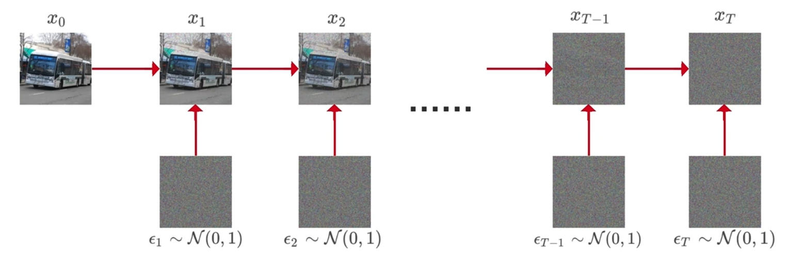

##### This document will demonstrate why fine-tuning diffusion at random time steps is feasible and robust in \< Universal Rumor Detection Method on Modality Consistency and External Knowledge \>.

The standard diffusion process can be represented as:
$$
q(\mathbf{x}_t | \mathbf{x}_{t-1}) = \mathcal{N}(\mathbf{x}_t; \sqrt{1 - \beta_t} \mathbf{x}_{t-1}, \beta_t \mathbf{I}) 
\tag{1}
$$
where $\beta_t$ is the noise intensity at time step $t$, and $x_t$ is the noisy image at time $t$, where $\beta_t$ is a hyperparameter, and satisfies $0 < \beta_t <1 $ and $\beta_1 < \beta_2 < ...<\beta_{t-1} < \beta_t $. 

If we want to sample a $z$ from a Gaussian distribution $z \sim \mathcal{N}(z; \mu_\theta, \sigma^{2}_\theta \mathbf{I})$, we can write it as follow:

$$
z = \mu_\theta+\sigma_\theta \epsilon, \epsilon \sim \mathcal{N}(0,  \mathbf{I})
\tag{2}
$$

The forward diffusion can be represented in terms of images as:

Based on the above information, we can conclude that:
$$
\begin{equation}\begin{split} 
\mathbf{x_1} = \sqrt{1 - \beta_1}\mathbf{x}_{0} + \sqrt{\beta_1} \epsilon_{1}, \epsilon_{1} \sim \mathcal{N}(0,  \mathbf{I}) \\ 
\mathbf{x_2} = \sqrt{1 - \beta_2}\mathbf{x}_{1} + \sqrt{\beta_2} \epsilon_{2}, \epsilon_{2} \sim \mathcal{N}(0,  \mathbf{I})\\ 
\mathbf{x_3} = \sqrt{1 - \beta_3}\mathbf{x}_{2} + \sqrt{\beta_3} \epsilon_{3}, \epsilon_{3} \sim \mathcal{N}(0,  \mathbf{I})\\ 
.........................................................
\end{split}\end{equation}
\tag{3}
$$

Thus, Equation (1) can be written as:
$$\begin{equation}
\mathbf{x_t} = \sqrt{1 - \beta_t}\mathbf{x}_{t-1} + \sqrt{\beta_t} \epsilon_{t},\epsilon_t \sim \mathcal{N}(0,  \mathbf{I})
\end{equation}
\tag{4}
$$
Where $\epsilon_t$ is a random number that is re-sampled at each time $t$.

Let $ {\alpha}_t = 1 - \beta_t $, we obtain:

$$\begin{equation}
\mathbf{x}_t = \sqrt{{\alpha}_t} \mathbf{x}_{t-1} + \sqrt{1 - {\alpha}_t} \mathbf{\epsilon_t} ,\epsilon_t \sim \mathcal{N}(0,  \mathbf{I})
\end{equation}
\tag{5}
$$

By continuously iterating, we can derive:
$$
\begin{equation}\begin{split} 
\mathbf{x}_t &=\sqrt{{\alpha}_t} \mathbf{x}_{t-1} + \sqrt{1 - {\alpha}_t} \mathbf{\epsilon_t} \\ 
&=\sqrt{{\alpha}_t}(\sqrt{{\alpha}_{t-1}} \mathbf{x}_{t-2} + \sqrt{1 - {\alpha}_{t-1}} \mathbf{\epsilon_{t-1}})+\sqrt{1 - {\alpha}_t} \mathbf{\epsilon_t}\\ 
&=\sqrt{{\alpha}_t}[\sqrt{{\alpha}_{t-1}} (\sqrt{{\alpha}_{t-2}} \mathbf{x}_{t-3} + \sqrt{1 - {\alpha}_{t-2}} \mathbf{\epsilon_{t-2}} ) + \sqrt{1 - {\alpha}_{t-1}} \mathbf{\epsilon_{t-1}})]+\sqrt{1 - {\alpha}_t} \mathbf{\epsilon_t}\\ 
& = ...... \\
& = \sqrt{{\alpha}_t}\sqrt{{\alpha}_{t-1}}...\sqrt{{\alpha}_1}x_0+\sqrt{{\alpha}_t}\sqrt{{\alpha}_{t-1}}...\sqrt{{\alpha}_2}\sqrt{1-\alpha_1}\epsilon_1+\sqrt{{\alpha}_t}\sqrt{{\alpha}_{t-1}}...\sqrt{{\alpha}_3}\sqrt{1-\alpha_2}\epsilon_2+...+\sqrt{\alpha_t}\sqrt{1-\alpha_{t-1}\epsilon_{t-1}}+\sqrt{1-\alpha_t}\epsilon_t
\end{split}\end{equation}
\tag{6}
$$
Where $\epsilon_1 ... \epsilon_t$ all follow a standard normal distribution, following the distribution of $\mathcal{N}(0,  \mathbf{I})$, possessing the following two properties:
$$c\epsilon \sim \mathcal{N}(0,  c^2\mathbf{I}),c \text{ is a constant.}\\
\text{Additivity means that } \mathcal{N}(0,  \mathbf{\sigma_{1}^{2}I}) + \mathcal{N}(0,  \mathbf{\sigma_{2}^{2}I}) \sim \mathcal{N}(0,  \mathbf{(\sigma_{1}^{2}+\sigma_{2}^{2})I})$$
Based on the above properties, we can conclude that
$$\sqrt{{\alpha}_t}\sqrt{{\alpha}_{t-1}}...\sqrt{{\alpha}_2}\sqrt{1-\alpha_1}\epsilon_1 \sim \mathcal{N}(0, {\alpha}_t {\alpha}_{t-1}...{\alpha}_2({1-{\alpha}_1}) \mathbf{I})$$
Furthermore, from additivity, we can derive that the variance is 
$$
\begin{equation}\begin{split}
&{\alpha}_t {\alpha}_{t-1}...{\alpha}_2({1-{\alpha}_1})+{\alpha}_t {\alpha}_{t-1}...{\alpha}_3({1-{\alpha}_2})+...+\alpha_t(1-\alpha_{t-1})+(1-\alpha_t)\\
&= \alpha_t [\alpha_{t-1}...\alpha_2(1-\alpha_1)+\alpha_{t-1}...\alpha_3(1-\alpha_2)+...+(1-\alpha_{t-1})-1]+1\\
&= \alpha_t [\alpha_{t-1}...\alpha_2(1-\alpha_1)+\alpha_{t-1}...\alpha_3(1-\alpha_2)+...+\alpha_{t-1}(1-\alpha_{t-2})-\alpha_{t-1}]+1\\
&= \alpha_t\alpha_{t-1} [\alpha_{t-2}...\alpha_2(1-\alpha_1)+\alpha_{t-2}...\alpha_3(1-\alpha_2)+...+\alpha_{t-2}(1-\alpha_{t-3})-\alpha_{t-2}]+1\\
&=\alpha_t\alpha_{t-1}...\alpha_3[\alpha_2(1-\alpha_1)+(1-\alpha_2)-1]+1\\
&=1-\alpha_t\alpha_{t-1}...\alpha_3\alpha_2\alpha_1\\
& = 1-\bar{\alpha}_t
\end{split}\end{equation}
\tag{7}
$$
Where $\bar{\alpha}_t = \alpha_t\alpha_{t-1}...\alpha_3\alpha_2\alpha_1$.
Therefore, we can get 
$$
\begin{equation}\begin{split}
\mathbf{x}_t &= \sqrt{{\alpha}_t} \mathbf{x}_{t-1} + \sqrt{1 - {\alpha}_t} \mathbf{\epsilon_t} \\
&=\sqrt{{\alpha}_t}\sqrt{{\alpha}_{t-1}}...\sqrt{{\alpha}_1}x_0+\sqrt{1 - {\bar{\alpha}}_t} \mathbf{\epsilon}\\
&= \sqrt{\bar{\alpha}_t} \mathbf{x}_0 + \sqrt{1 - \bar{\alpha}_t} \mathbf{\epsilon}
\end{split}\end{equation}
\tag{8}
$$
The above formula (8) is the derivation proof of formula (8) in our article. Given $x_t$ and $\bar{\alpha_t}$, we only need to predict the distribution of $\epsilon$ as accurately as possible to obtain $x_0$. That is 
$$
x_0 \approx \frac{x_t - \sqrt{1-\bar{\alpha_t}}\epsilon_\theta(x_t,t)}{\bar{\alpha}_t}
\tag{9}
$$
Where $\epsilon_\theta$ is the predicted noise. So, when we fine-tune the unet, we can complete the fine-tuning by minimizing the gap between the actual error $\epsilon(x_t,t)$ and the predicted error $\epsilon_\theta(x_t,t)$ by MSE(Mean Squared Error). 
$$ \mathcal{L_{diffusion}} = \mathbb{E}_{\mathbf{x}_0, t, \mathbf{\epsilon}} \left[ |\mathbf{\epsilon} - \epsilon_\theta(\mathbf{x}_t, t)|^2 \right] 
\tag{10}
$$